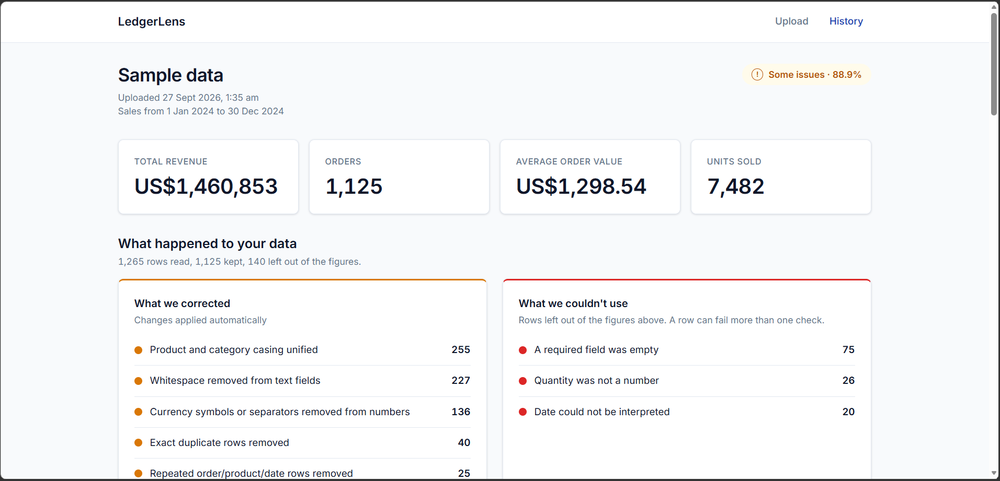
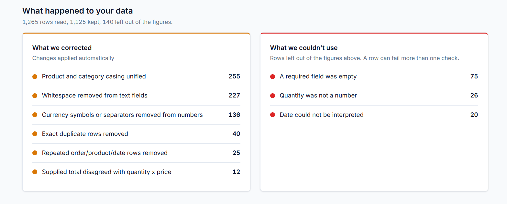
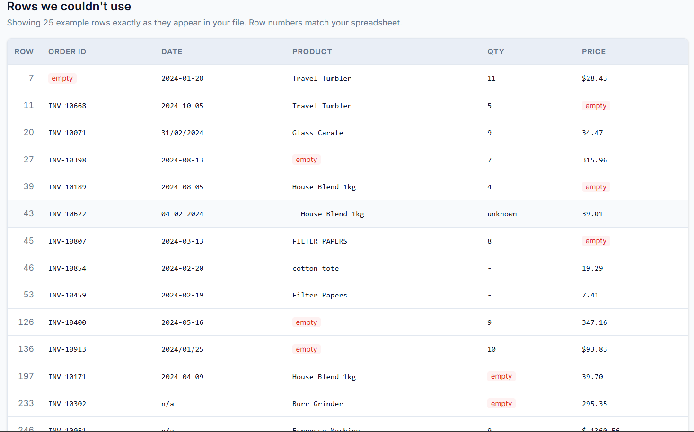
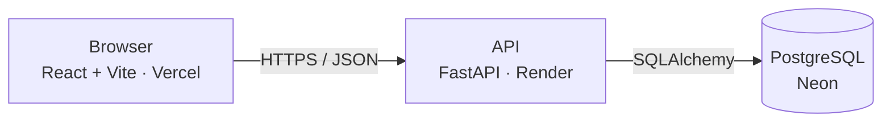
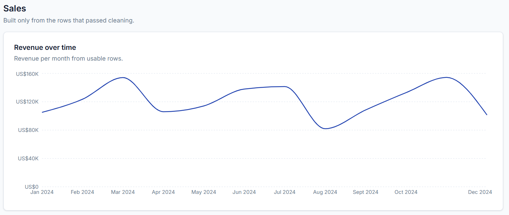
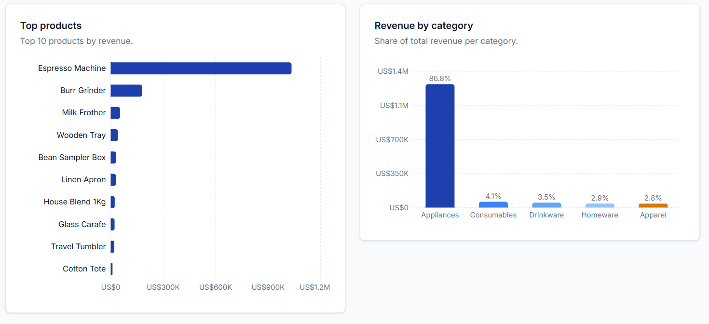

# LedgerLens

Cleans messy small-business sales CSVs, reports every correction and rejection, and turns the result into a sales dashboard.

**Live demo:** https://ledgerlens-tyc.vercel.app. Click "Load sample data" to try it without a file of your own.

The API runs on a free tier and sleeps when idle, so the first request can take up to a minute.



## What it does

Small businesses often keep sales records in spreadsheets maintained by hand. Over time those files collect dates written three different ways, duplicate rows, prices with currency symbols typed into them, and product names spelled in inconsistent casing. Any total calculated from the raw file is wrong, and nothing tells you so.

LedgerLens takes that file, fixes what can be fixed, sets aside what can't, and builds the sales figures only from the rows that survived. The report lists each change it made and each row it rejected, with the original text from the file, so the numbers can be checked against the source.

## How it works

1. Every value is read as text, so nothing gets converted before the pipeline can inspect it.
2. Column headers are matched against known alternatives, so `QTY`, `Order No.` and `Item Name` all resolve.
3. Text fields are trimmed, and product and category names are brought to consistent casing.
4. Numbers are cleaned: currency symbols and thousands separators are removed, and accounting negatives like `(45.00)` become `-45.00`.
5. Dates are parsed against five explicit formats. Anything that doesn't match, such as `31/02/2024` or `TBC`, is rejected rather than guessed.
6. Exact duplicate rows are removed, then rows repeating the same order, product and date.
7. Rows missing a required field, or with a quantity of zero or less or a negative price, are rejected.
8. `line_total` is recalculated as quantity × unit price. Rows where the file's own total disagreed by more than a cent are flagged.
9. Metrics are computed once and stored with the dataset.





## Architecture



The browser only talks to the API. Uploaded files are processed in memory and never written to disk, because the hosting platform's disk is wiped on every restart. Only the cleaned rows, the cleaning report and the computed metrics are stored.

## Tech stack

- **Backend:** Python, FastAPI, pandas, SQLAlchemy 2.0, Alembic
- **Database:** PostgreSQL (Neon)
- **Frontend:** React, TypeScript, Vite, React Router, Recharts
- **Hosting:** Render (API), Vercel (frontend), GitHub Actions (keep-warm job)

## Expected CSV format

Headers are matched case-insensitively, and spaces and punctuation are ignored, so `Order No.` matches `order_no`.

| Field | Required | Accepted header names |
|---|---|---|
| Order ID | Yes | `order_id`, `orderid`, `order_no`, `order_number`, `invoice`, `invoice_no` |
| Order date | Yes | `order_date`, `date`, `order_dt`, `transaction_date`, `sold_on` |
| Product | Yes | `product`, `product_name`, `item`, `item_name`, `sku_name` |
| Quantity | Yes | `quantity`, `qty`, `units`, `count` |
| Unit price | Yes | `unit_price`, `unitprice`, `price`, `rate`, `amount_each` |
| Customer | No | `customer_name`, `customer`, `client`, `buyer` |
| Category | No | `category`, `product_category`, `type`, `dept` |
| Line total | No | `line_total`, `total`, `amount`, `subtotal`, `revenue` |

Accepted date formats: `2024-01-21`, `21/01/2024`, `01-21-2024`, `21 Jan 2024`, `2024/01/21`.

Limits: CSV only, 5 MB, 20,000 rows.

## Dashboard





## API

| Method | Path | Purpose |
|---|---|---|
| `GET` | `/api/health` | Health check |
| `POST` | `/api/datasets/upload` | Upload and process a CSV |
| `POST` | `/api/datasets/sample` | Process the bundled sample file |
| `GET` | `/api/datasets` | List datasets, newest first |
| `GET` | `/api/datasets/{id}` | One dataset with its report and metrics |
| `DELETE` | `/api/datasets/{id}` | Soft delete |

Interactive documentation is generated at `/docs` on the API.

## Design decisions

**Numeric(12,2), not Float, for money.** Binary floating point can't represent 0.1 exactly. Sum a few thousand prices as floats and the total drifts by fractions of a cent, and the report stops reconciling. Numeric is exact base-10.

**`line_total` is recomputed, never trusted.** A supplied total is a claim, while quantity and unit price are the inputs. When they disagree there's no way to tell which one is wrong, but the derived value at least agrees with the two columns every metric is built from. Disagreements are reported so the source file can be fixed.

**`keep_default_na=False` when reading the CSV.** By default pandas turns `N/A`, `n/a`, `NA`, `null` and similar strings into missing values before any code sees them. With this off, the report can say a cell contained the text `N/A` rather than just that it was empty, which is what someone needs to go and correct their file.

**Metrics are computed at upload and stored.** A dataset never changes after it's uploaded, and computing metrics means a full pass over every row. Recomputing on every page load would repeat that work for an identical answer.

**`pool_pre_ping=True` on the database engine.** Neon's free tier suspends after a few minutes idle and drops pooled connections without the pool noticing. Without this setting, the first request after a quiet period fails with "server closed the connection unexpectedly." The check replaces dead connections before they're used.

**Soft delete.** Deleting a dataset sets `deleted_at` rather than removing rows, so a deletion can be reversed at the database level.

## Known limitations

- `.str.title()` renders `House Blend 1kg` as `House Blend 1Kg`. Metrics are unaffected because every row gets the same treatment, but the displayed name doesn't match the original.
- Rejection reason counts can overlap. A row with a blank product and an unreadable date counts under both reasons, so the reasons don't add up to the rejected total.
- There is no authentication. Every dataset is visible to every visitor.
- An upload is read fully into memory before the size limit is checked.
- The API sleeps on the free tier. A scheduled job keeps it awake from 8am to midnight Malaysia time only, and GitHub pauses scheduled workflows after 60 days without a commit.

## Running locally

Requires Python 3.12 and Node.js 20.19+ or 22.12, plus a PostgreSQL database.

### API

```bash
cd api
python -m venv venv
source venv/bin/activate          # Windows: venv\Scripts\activate
pip install -r requirements.txt
cp .env.example .env              # add your DATABASE_URL
alembic upgrade head
uvicorn app.main:app --reload
```

### Frontend

```bash
cd web
npm install
cp .env.example .env
npm run dev
```

### Test data

`api/scripts/generate_sample.py` writes `api/data/sample_messy.csv`, a 1,265-row file with deliberate defects: padded whitespace, mixed casing, currency symbols, five date formats, impossible dates, blank required fields, text in numeric columns, wrong totals, and duplicates. The pipeline is checked against it.

```bash
cd api
python -m scripts.generate_sample
python -m scripts.check_clean
```

## Licence

MIT. See [LICENSE](LICENSE).